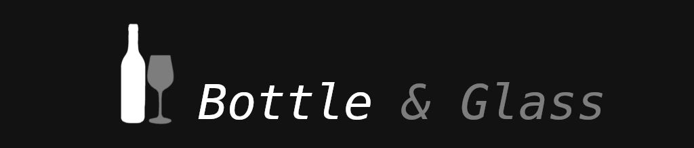
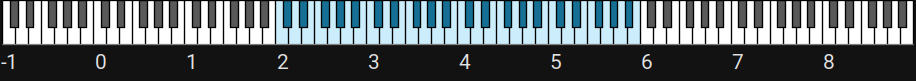
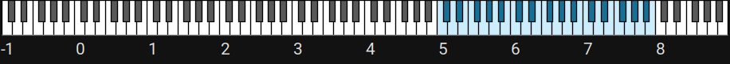
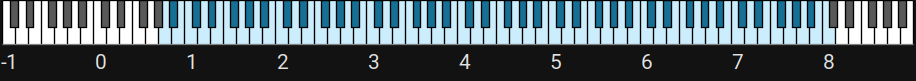

[SFZ instrument](https://sfzformat.com/) that I created using a bottle and a glass :) (actually, a number of glasses). The quality of the samples isn't amazing, but it's not too bad either. There are a few issues here and there, but overall, it's okay for what it is. IMHO, it sounds interesting. I've tested it in [sfizz](https://github.com/sfztools/sfizz), [LinuxSampler](https://www.linuxsampler.org) and [Sforzando](https://www.plogue.com/products/sforzando.html).

[Example Track](https://yancharkin.bandcamp.com/track/dream)

## Instruments

- **bottle.sfz** and **glass.sfz**: Minimalistic use of pitch shifting to maintain a natural sound.
- **bottle+.sfz** and **glass+.sfz**: Lowest and highest notes added by shifting the pitch of the lowest/highest available samples, which may occasionally sound less natural.
- **Bottle&Glass**: Combines bottle+ and glass+ simultaneously.

## Range

    
     
    bottle range (C2-B5)

    
     
    glass range (C5-B7)

    
     
    full range (A0-C8)

